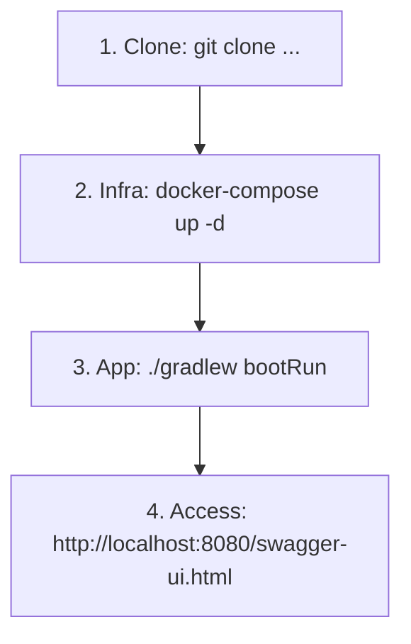
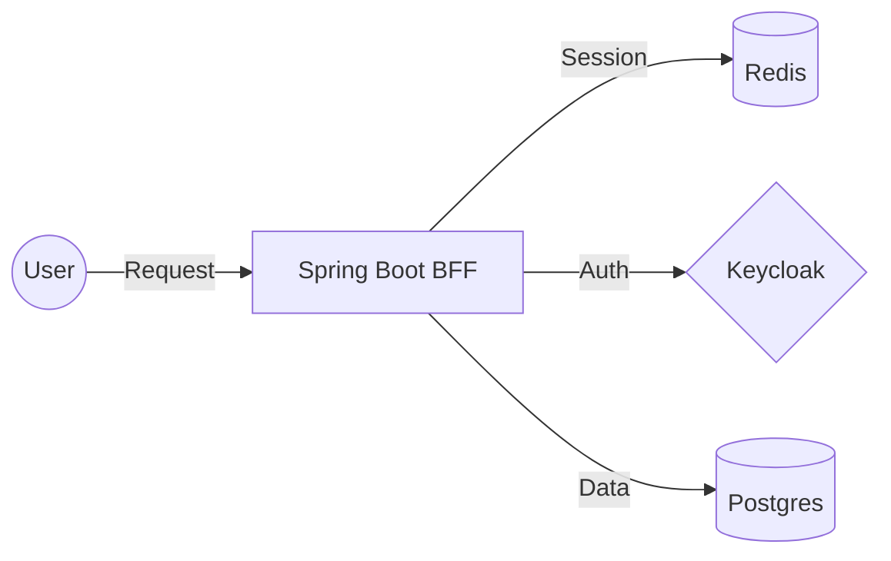

# KeycloakBff - Secure Backend-for-Frontend Implementation


Developed by **JagaDeep Sivaraman** | **Full Stack Software Engineer**

---

## 👋 About Me
I am an experienced **Full Stack Software Engineer** dedicated to building secure, scalable, and high-performance applications. This project is a **solely developed endeavor**, built entirely by me to showcase my end-to-end architectural and implementation capabilities. 
- **Backend Ecosystems**: Node.js, Java (Spring Boot), ASP.NET Core Web API, and Go (Gin).
- **Cloud Infrastructure**: Deep expertise in **AWS** (Lambda, EC2, Step Functions, EventBridge, S3, Amplify).
- **Data Engineering**: Extensive experience maintaining and optimizing over 30+ AWS Lambda functions responsible for mission-critical data loads and processing for large-scale enterprise applications.

As a developer, I am constantly updating my skills and my main hobby is exploring the latest tech, architecture patterns, and frameworks to bring the most modern solutions to my projects.

## 🎯 Why this Project?
I created **KeycloakBff** as a technical deep-dive into the **Backend-for-Frontend (BFF)** security pattern. 
While working with distributed systems, I recognized the critical need to hide sensitive OIDC tokens (JWTs) from the browser's JavaScript context to mitigate XSS risks. This project demonstrates:
- A secure, stateful session layer using **HttpOnly Cookies**.
- Real-time user synchronization between **Keycloak** and a local **PostgreSQL** database.
- Enterprise-grade infrastructure orchestration via **Docker Compose**.
- High-performance session management backed by **Redis**.

*This project serves as a showcase of my ability to design and implement complex security architectures that follow industry best practices.*

## 📈 Developer Onboarding / Quick Start Flow


---

## 📘 Documentation Reference

The documentation is organized into clear reference guides designed for high-level stakeholders and technical peers:

- [**Project Overview & Rationale**](./docs/overview.md) - **The "Big Picture"**: Why BFF? Why Java 25? Why Gradle? (And why tests are coming soon!)
- [**Quick Start & Setup Guide**](./docs/startup-guide.md) - **Onboarding**: Step-by-step instructions for local development.
- [**System & Security Architecture**](./docs/architecture.md) - **Request Flows**: Deep dive into filters, flows, and all possible authentication scenarios.
- [**Database Design**](./docs/database-design.md) - **Data Sync**: ERD and details on Keycloak-to-App auto-synchronization.
- [**Infrastructure & Keycloak**](./docs/infrastructure.md) - **Setup Guide**: Detailed explanation of Docker Compose and the `realm.json` configuration.
- [**Blueprint: Testing Strategy**](./docs/testing-strategy.md) - **Quality**: The technical plan for Testcontainers and integration testing.
- [**Quick Reference: API Dashboard**](./docs/api-reference.md) - **Shortcuts**: Concise table of core endpoints and required roles.
- [**Architectural Improvements**](./docs/improvements.md) - **Roadmap**: My plan for future security and performance optimizations.

---

## 🛠️ Performance & Scalability Highlights


- **Java 25 Ready**: Utilizes modern JVM features for optimal performance.
- **Stateless/Stateful Hybrid**: Combines the scalability of a stateless backend with the security of stateful sessions via Redis.
- **Dockerized Infrastructure**: One-command setup for Keycloak, Postgres, and Redis.

## 🚀 Getting Started
```bash
# 1. Start the infrastructure
docker-compose up -d

# 2. Run the application
./gradlew bootRun
```

---
*Connect with me to discuss architectural patterns, security, or Java performance!*

[GitHub: Jaga1999](https://github.com/Jaga1999)
