# System & Security Architecture

## 📐 System Component Architecture

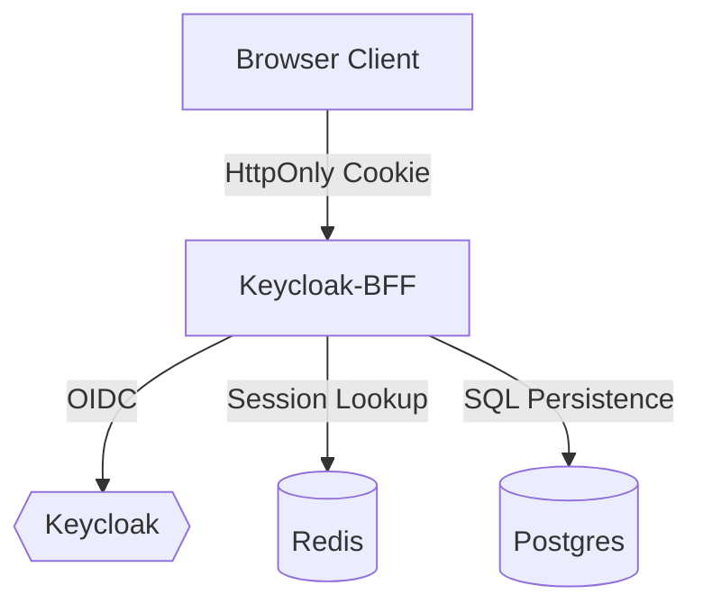

---

## 🏗️ Architectural Comparison: BFF vs. Direct API
This diagram highlights why the BFF layer is essential for modern web security.

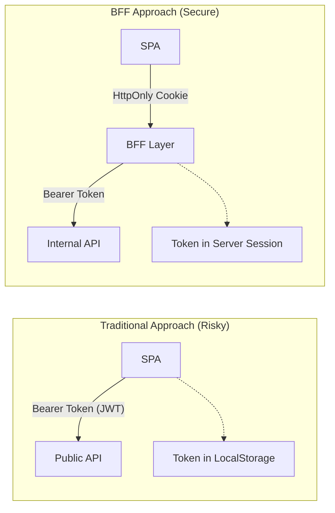

---

## 🔐 Authentication Scenarios

The `SessionAuthenticationFilter` handles multiple runtime scenarios to ensure the user's identity is always valid and secure.

### Scenario 1: First-Time Login (Establishing Identity)
1. User provides credentials to `/api/auth/login`.
2. BFF exchanges them for JWTs via Keycloak.
3. Syncs user to local DB and stores JWTs in Redis.
4. Returns `SESSION_ID` cookie.

### Scenario 2: Active Session (Normal Request)
1. Client sends `SESSION_ID` cookie.
2. BFF finds JWTs in Redis.
3. Access Token is valid -> Request is authorized.

### Scenario 3: Access Token Expired (Transparent Refresh)
1. BFF detects Access Token is expired but **Refresh Token is still valid**.
2. BFF calls Keycloak `/token` (refresh_token grant).
3. Keycloak issues new tokens.
4. BFF updates Redis and proceeds with the original request.

### Scenario 4: Session Expired / Invalid (Re-Authentication)
1. Either `SESSION_ID` is missing, not in Redis, or the Refresh Token has also expired.
2. BFF clears the security context and returns **401 Unauthorized**.
3. Client must redirect the user to the login page.

### Comprehensive Auth Logic Flow

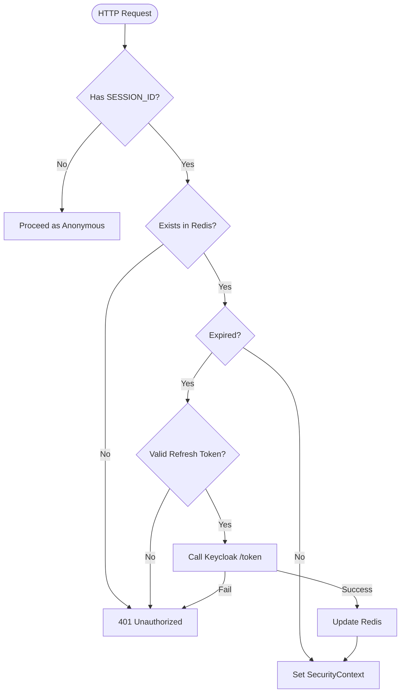

---

## 🔄 Deep Dive: The Session Lifecycle

This section explains how a user's session moves from creation to absolute expiration, including the transparent refresh of both tokens.

### 1. 🐣 Session Creation (The Login)
When a user logs in, the BFF initiates the "Password Grant" (or Authorization Code) flow with Keycloak.
- **Tokens Received**: Keycloak issues an **Access Token** (short-lived) and a **Refresh Token** (long-lived).
- **Redis Entry**: The BFF generates a unique `SESSION_ID` (UUID) and stores both tokens in Redis, mapped to this ID.
- **Client Side**: A `Set-Cookie` header is sent with the `SESSION_ID`, marked as `HttpOnly`, `Secure`, and `SameSite=Strict`.

### 2. ⚡ The 'Remember Me' Logic
If "Remember Me" is selected:
- **Cookie Persistence**: The `SESSION_ID` cookie is set with a long `Max-Age` (e.g., 30 days) instead of being a transient session cookie.
- **Keycloak Persistence**: The BFF requests an `offline_access` scope from Keycloak, ensuring the **Refresh Token** remains valid even if the user closes their browser and the Keycloak SSO session expires.

### 3. 🔄 Token Refresh Mechanics (The "Middle" Life)
The system manages two tiers of refresh to keep the session alive without user intervention.

#### A. Access Token Refresh
- **Trigger**: Access Token is expired (or < 60s from expiry).
- **Action**: BFF uses the stored **Refresh Token** to call `/token`.
- **Result**: New Access Token and (optionally) a new Refresh Token are saved back to Redis under the same `SESSION_ID`.

#### B. Refresh Token Rotation
- **Action**: If "Refresh Token Rotation" is enabled in Keycloak, every time I refresh the Access Token, Keycloak also issues a **New Refresh Token**.
- **Security**: The old Refresh Token is invalidated immediately, making the session more secure against replay attacks.

### 4. 🛑 Session Deletion (The Logout/Expiry)
- **Manual Logout**: User calls `/api/auth/logout`. BFF revokes tokens in Keycloak and deletes the entry from Redis.
- **Idle Expiry**: If the user is inactive beyond the **Refresh Token lifespan**, the session is considered dead.
- **Absolute Expiry**: Controlled by the `ssoSessionMaxLifespan` in Keycloak.

---

## 📊 Lifecycle Visualization: From Birth to Death

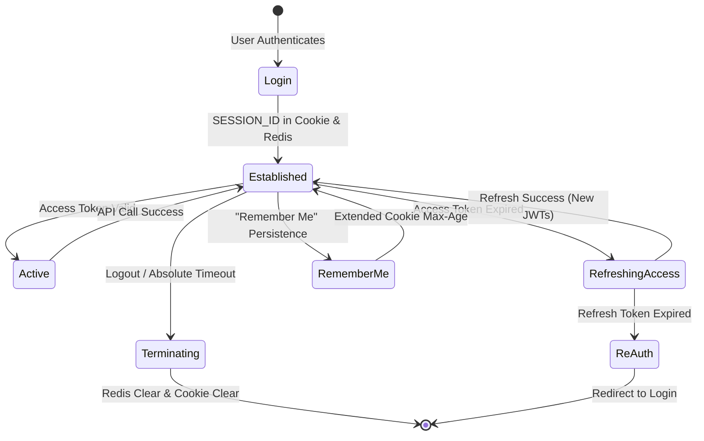

### The "Token Pyramid" Relationship
| Layer | Stored In | Persistence |
| :--- | :--- | :--- |
| **Session ID** | Browser (Cookie) | Temporary or Long-term (Remember Me) |
| **Refresh Token** | Server (Redis) | Long-lived (e.g., 8h - 30d) |
| **Access Token** | Server (Redis) | Short-lived (e.g., 15m) |

---

## 🔄 The Full Request Flow

Every request to a protected endpoint (like `GET /todos`) follows this exact path:

```mermaid
sequenceDiagram
    participant Client
    participant Filter as SessionAuthFilter
    participant Redis
    participant Logic as TodoService
    participant DB as Postgres

    Note over Client, Filter: Stateless HTTP + State-backed Cookie
    Client->>Filter: Request (Cookie: SESSION_ID)
    
    Filter->>Redis: getSession(uuid)
    Redis-->>Filter: Stored JWT Tokens
    
    rect rgb(240, 240, 240)
    Note over Filter: Auth Scenario Check
    alt Needs Refresh
        Filter->>Filter: Refresh via Keycloak
    end
    end

    Filter->>Logic: Execute Business Logic (e.g., list todos)
    activate Logic
    Logic->>DB: SELECT * FROM todos WHERE owner_id = ?
    activate DB
    DB-->>Logic: Results
    deactivate DB
    Logic-->>Filter: List of DTOs
    deactivate Logic
    Filter-->>Client: 200 OK (JSON)
    deactivate Filter
```

### Detailed Request Flow: DELETE /api/todos/{id}
Example of a state-changing request requiring ownership verification.

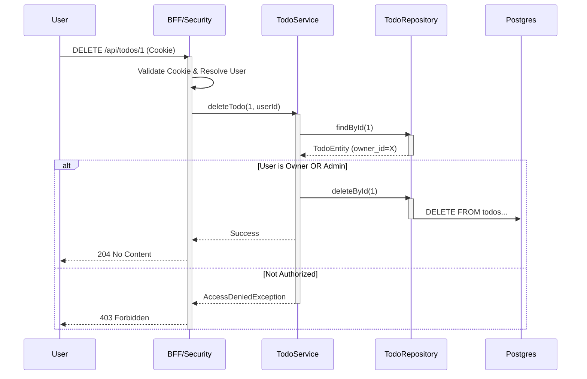

### Scenario: Failed Authentication / Session Timeout
This diagram shows what happens when a session is no longer valid.

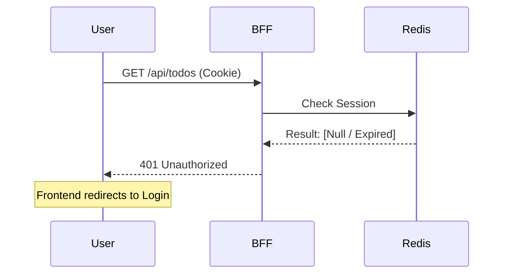

---

## 🚨 Exception Handling & Error Propagation Flow
Understanding how the system reacts to failures is crucial for troubleshooting.

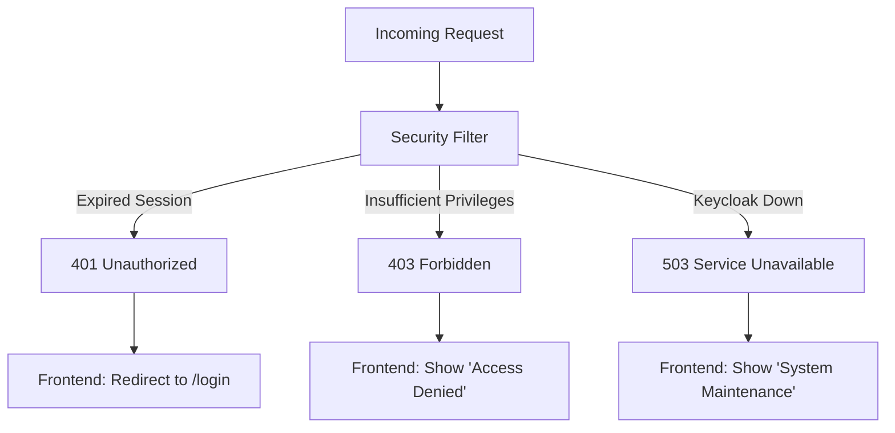

## ❤️ Session Heartbeat & Token Refresh Logic
The BFF proactively manages token lifecycles to ensure a seamless user experience.

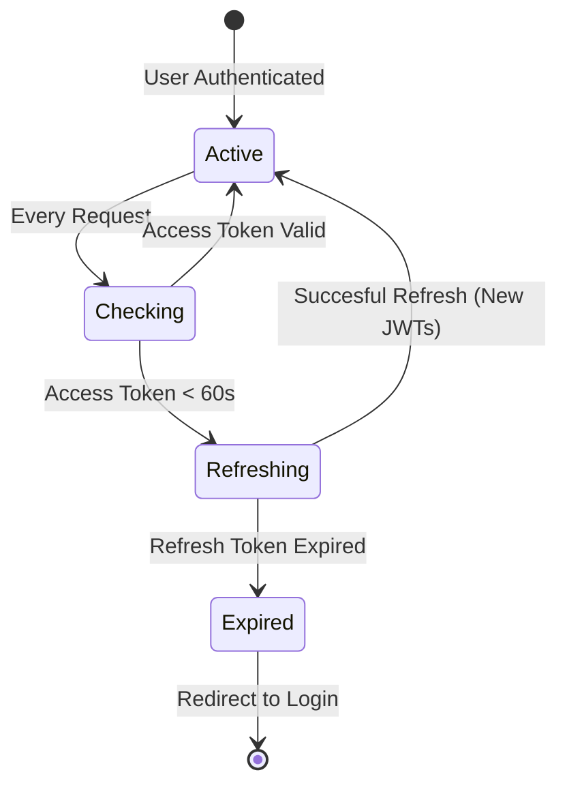

## 🔐 Granular Resource Access Logic (RBAC)
How the system decides if a user can access a specific resource (e.g., a Todo).

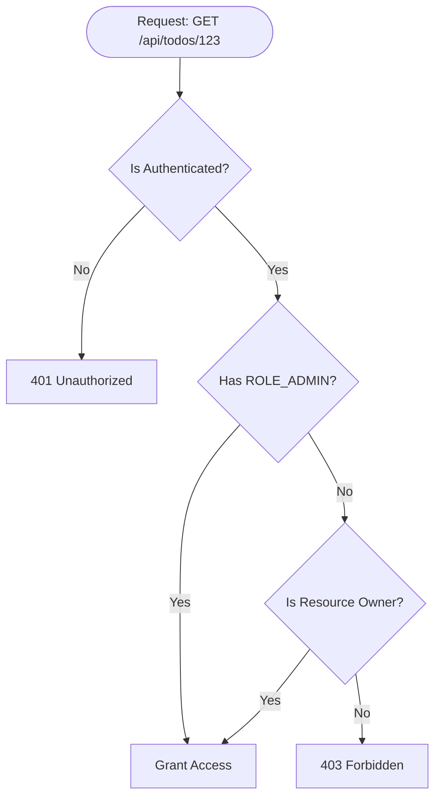

## 🛡️ CSRF Protection Flow
Even with `SameSite=Strict`, I implement double-submit cookies or custom headers for enhanced CSRF protection.

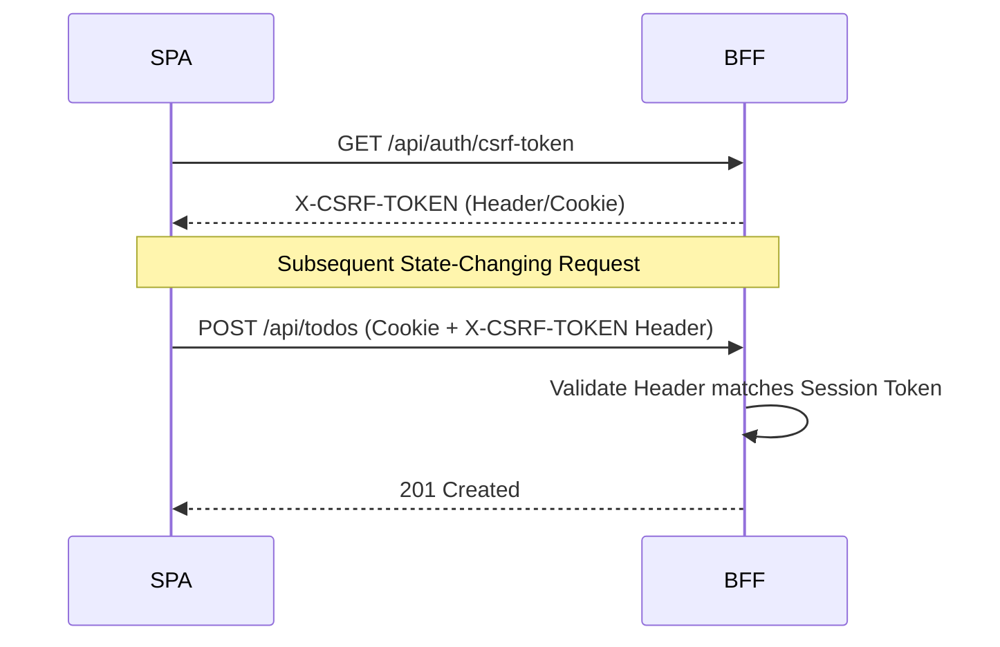

## 📈 Scalability: Distributed Session Model
How the system handles multiple BFF nodes using a shared Redis state.

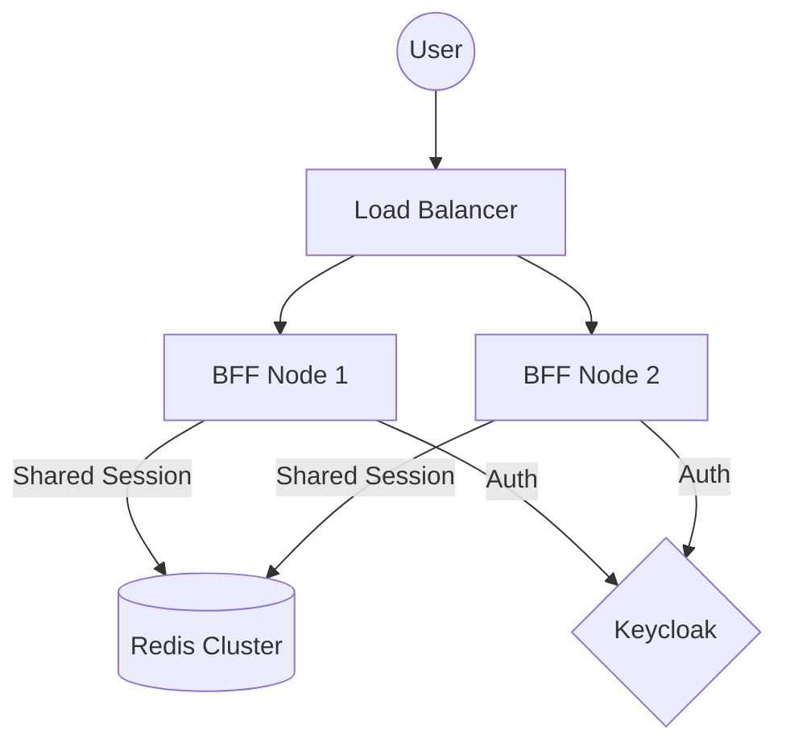

## ⚙️ Configuration without Code Changes
You can modify the system behavior via `src/main/resources/application.yml`:
- **`server.port`**: Change the port the BFF listens on.
- **`app.security.session-cookie-name`**: Customize the cookie name.
- **`app.keycloak.server-url`**: Point to a different Keycloak instance.
- **`logging.level.com.example.bff`**: Increase to `DEBUG` for detailed auth logs.
