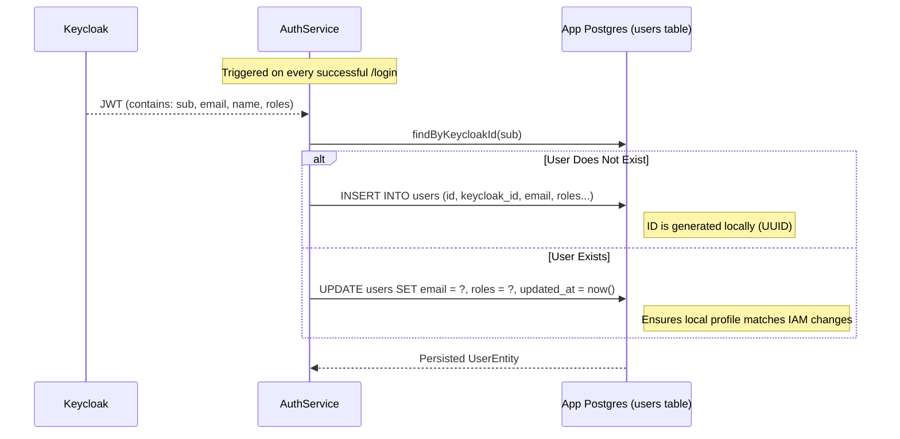
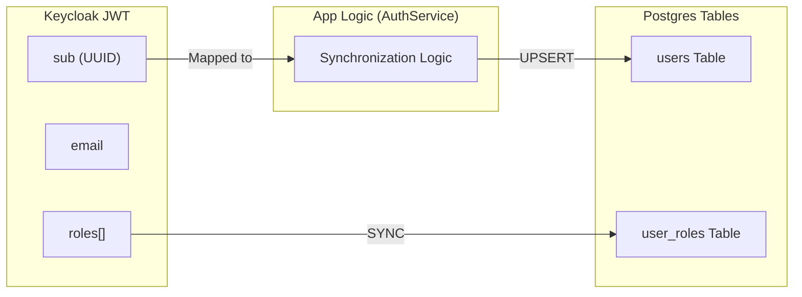
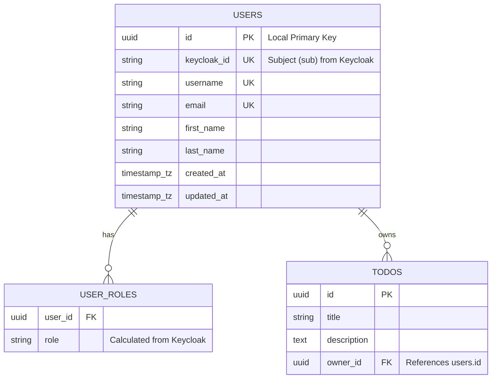
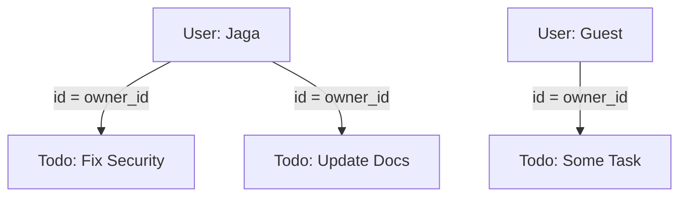

# Database Design

KeycloakBff uses a relational **PostgreSQL** database to store application-specific data, while delegating identity management to **Keycloak's internal schema**.

## 📊 Auto-Sync Logic: Keycloak to App DB

The "Source of Truth" for users is Keycloak. However, I sync them to my local DB to allow for high-performance relations (e.g., User owns Todo).

### Synchronization Sequence

---

## 🔗 Keycloak to App DB Connection

The connection between the two databases is **virtual and federated**, maintained via the `keycloak_id` field.

The connection between the two databases is **virtual and federated**, maintained via the `keycloak_id` field.

---

## 🗄️ Detailed Table Reference

### `users`
Synced directly from the ID Token / Access Token claims. The `keycloak_id` is the immutable anchor link.

### `user_roles`
Extracted from the `realm_access.roles` claim in the Keycloak JWT. This table enables standard Spring Security RBAC without needing to re-parse the JWT on every single query.

### `todos`
Our primary business table. It relates back to the `users` table via `owner_id`.

