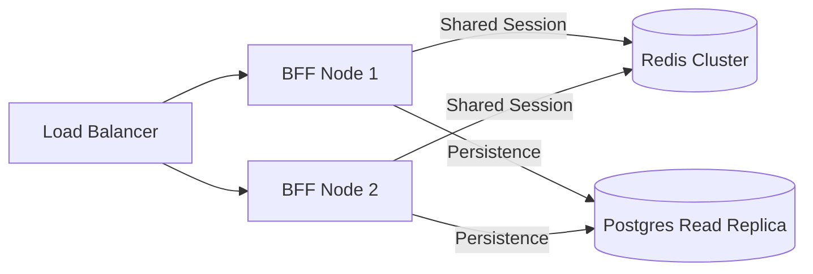

# Architectural Improvements

The following roadmap outlines enhancements for security, performance, and scalability.

## 🔒 Security Roadmap
- **Authorization Code Flow + PKCE**: Move away from Password Grant so the BFF never touches user credentials directly.
- **CSRF Token Repository**: Enable Spring Security's CSRF protection using a double-submit cookie pattern suitable for SPAs.

## 🚀 Performance Roadmap
- **Virtual Threads**: Since the system targets **Java 25**, enable `spring.threads.virtual.enabled=true` to handle high-concurrency I/O.
- **L1 Cache**: Use Caffeine to cache session lookups locally for 2-5 seconds, significantly reducing Redis load.

## ⚙️ Resilience Roadmap
- **Circuit Breakers**: Implement Resilience4j around `KeycloakAuthClient` to prevent cascading failures if the IAM is slow.
- **Admin Token Management**: Cache the Keycloak Admin Access Token instead of requesting it for every user check.

---

## 📐 Scalability visualization

