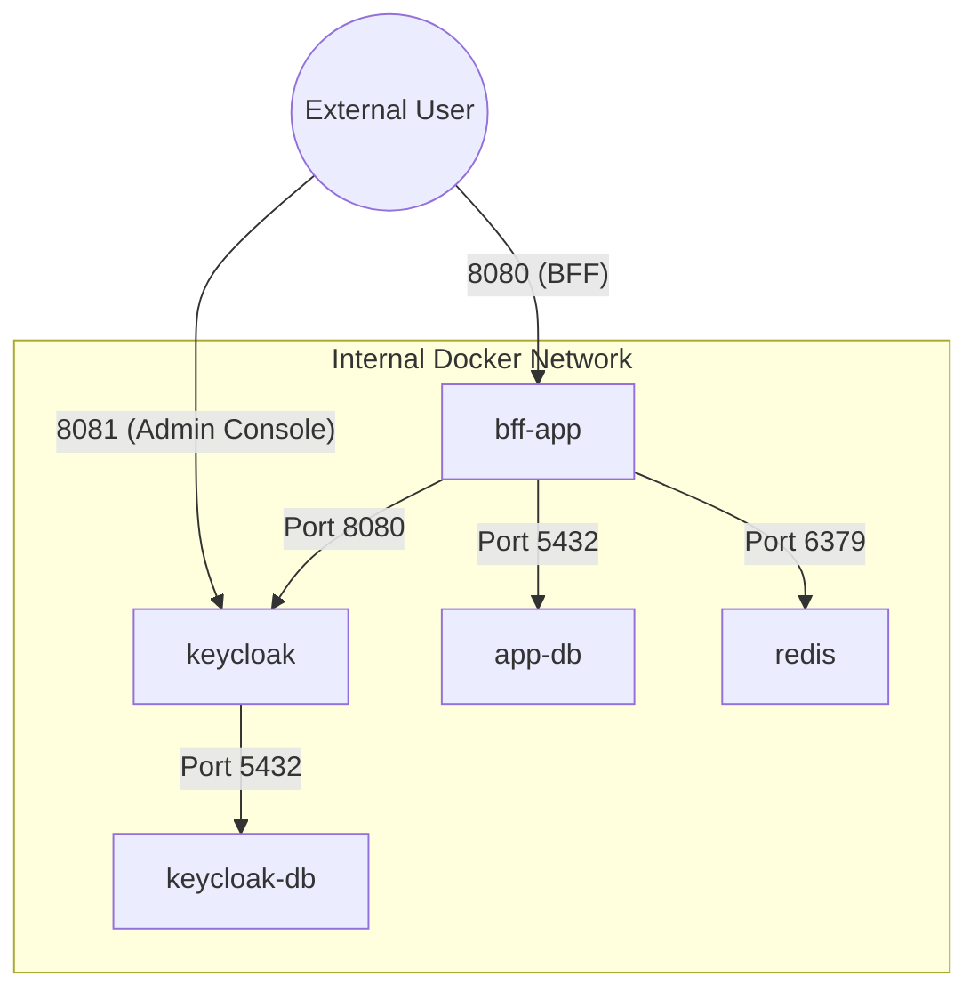
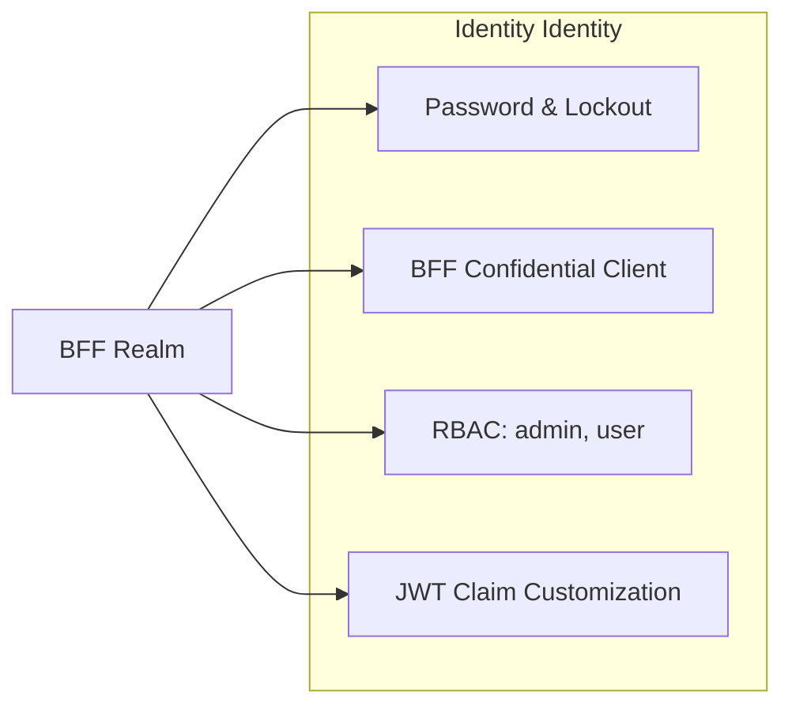
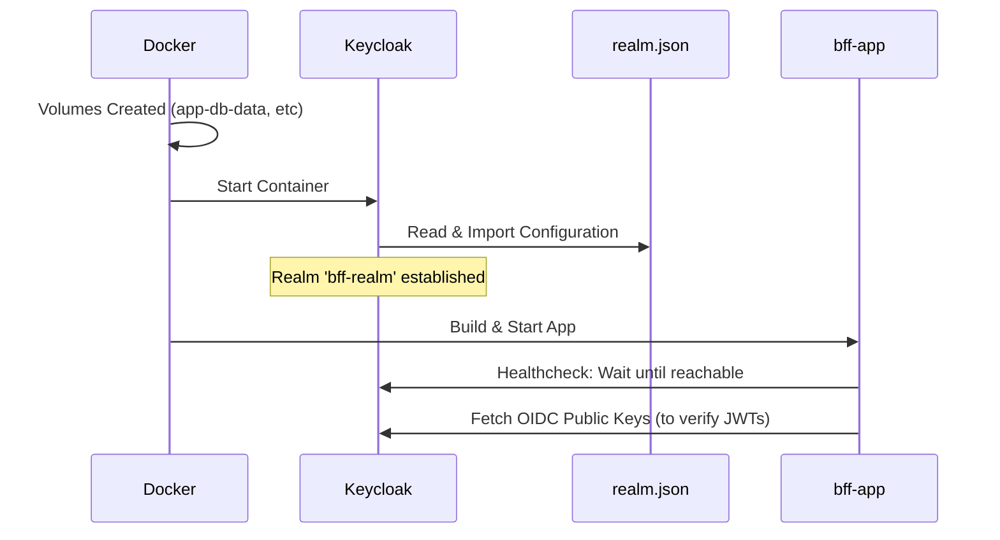
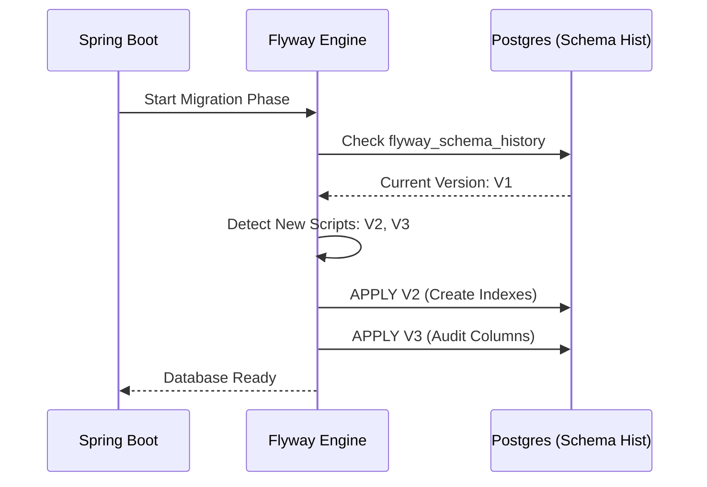

# 🏗️ Infrastructure & Security Deep-Dive

This document provides a production-grade analysis of my infrastructure layer, covering the **Docker Compose** orchestration and the **Keycloak IAM** configuration in exhaustive detail.

---

## 🐋 1. Docker Compose: Orchestration Architecture

Our `docker-compose.yml` doesn't just run containers; it defines a secure, isolated micro-ecosystem.

### 🌐 Network Isolation Design
All services reside on a default internal bridge network. Only the **BFF App** and **Keycloak** expose ports to the host machine.



### 📦 Service Granular Analysis

| Service | Image | Key Rationale |
| :--- | :--- | :--- |
| **`app-db`** | `postgres:16` | **Data Isolation**: Dedicated instance for business data and user profiles. Uses persistent volumes (`app-db-data`) to prevent data loss on restarts. |
| **`keycloak-db`** | `postgres:16` | **Security Best Practice**: Separation of IAM data from App data. Even if the App DB is compromised, the IAM credentials remain in a separate silo. |
| **`redis`** | `redis:7-alpine` | **Performance**: Used as a high-speed, stateful session store. Configured with `--appendonly yes` to ensure sessions survive a Redis crash. |
| **`keycloak`** | `quay.io/...:25.0` | **Stateless Scaling**: Reads configuration from `realm.json` on every cold start via the `--import-realm` flag. |
| **`bff-app`** | `Dockerfile` | **Environment Injection**: Uses environment variables to dynamically resolve internal Docker DNS names (e.g., `redis`, `app-db`). |

---

## 🔑 2. Keycloak `realm.json`: The Security Blueprint

The `realm.json` file is my **Infrastructure-as-Code (IaC)** for Identity. It defines precisely how users are authenticated and what they can do.

### 🛡️ Security Policies & Brute Force Protection
Our realm is hardened against password attacks out of the box:
- **Password Policy**: `length(10) and digits(1) and lowerCase(1) and upperCase(1) and specialChars(1)`.
- **Brute Force Detection**: `failureFactor(5)`—If a user fails login 5 times, they are locked out for 15 minutes (`maxFailureWaitSeconds: 900`).

### 🧬 Logical Configuration Flow


### 🗝️ The Confidential Client (`bff-client`)
The "Client" represents my BFF backend within Keycloak.
- **Access Token Lifespan**: **900s (15m)**. This ensures that even if a JWT is exfiltrated from the server, its window of utility is extremely short.
- **SSO Session Idle**: **1800s (30m)**. If the user stops interacting with the app, the session dies quickly.
- **Offline Access**: Enabled. This allows for **Long-term "Remember Me" sessions** where Keycloak issues a persistent Refresh Token.

### 🗺️ Protocol Mappers: The Bridge to Spring Security
This is the most critical part of my config. It tells Keycloak to map its internal **Realm Roles** into a specific JWT claim named `roles`.

```json
{
  "name": "realm roles",
  "protocolMapper": "oidc-usermodel-realm-role-mapper",
  "config": {
    "claim.name": "roles",
    "access.token.claim": "true"
  }
}
```
**Spring Boot Logic**: My `CustomAuthorityMapper` looks specifically for this `roles` array in the JWT and converts them into `SimpleGrantedAuthority` (e.g., `ROLE_ADMIN`).

---

## 🚀 Deployment & Initialization Flow



---

## 🚀 Flyway: Automatic Schema Migration
The system uses **Flyway** to ensure that the database schema is always in sync with the codebase.

### Migration Scenarios
1.  **First Start**: Flyway detects an empty database and runs all scripts in `src/main/resources/db/migration` to create tables (`users`, `todos`, etc.).
2.  **Versioning**: If a new migration script is added (e.g., to add a `priority` column to todos), Flyway applies it automatically on the next application startup.
3.  **Validation**: Flyway checks hashes of applied scripts to prevent accidental modification of historical migrations.



---
*This configuration ensures that the system is secure-by-default, scalable, and fully reproducible across any machine running Docker.*
