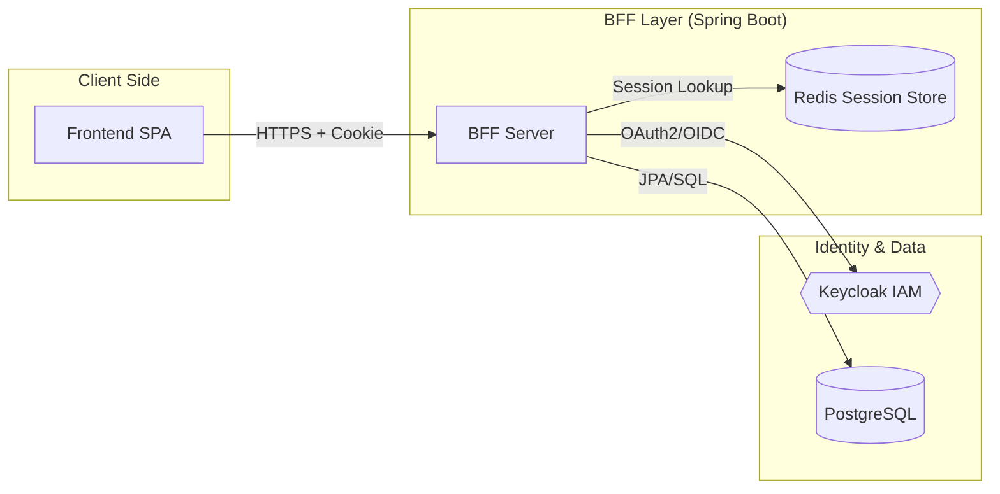
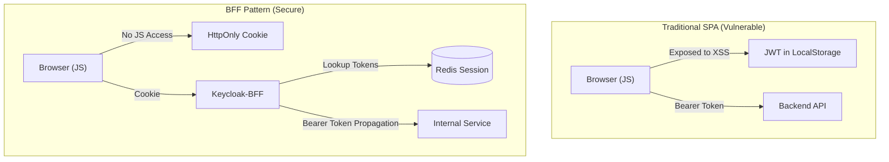
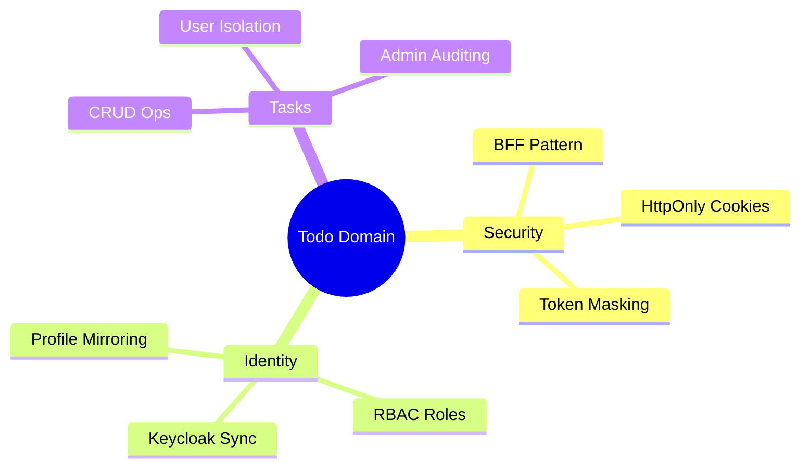
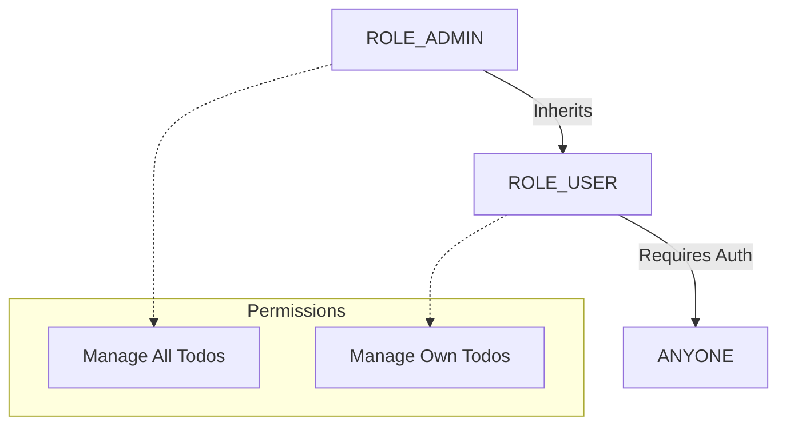

# Project Overview: KeycloakBff

## 🎯 Purpose
**KeycloakBff** is a robust Backend-for-Frontend (BFF) implementation designed to bridge the gap between client applications (Web/Mobile) and a secure identity provider (Keycloak). 

The primary goal of this project is to eliminate the risks associated with storing sensitive **OpenID Connect (OIDC) tokens** (Access/Refresh tokens) in the browser's local storage or session storage. By implementing a stateful session on the server side using **HttpOnly, Secure, and SameSite** cookies, the system provides a high level of protection against Cross-Site Scripting (XSS) and token theft.

## 🧱 Technical ecosystem
This diagram shows how the core technologies collaborate to secure your application.

---

## 🛡️ The BFF Rationale: Deep Security Reasoning

In traditional Single Page Applications (SPAs), the browser handles tokens directly. This exposes the application to the following critical vulnerabilities:
- **Token Theft via XSS**: Any script injected into the page can read `localStorage` and exfiltrate JWTs.
- **CSRF Complexity**: While headers mitigate CSRF, they don't solve the storage security issue.
- **Large Attack Surface**: Each client must implement OIDC logic, increasing the chance of implementation errors.

**KeycloakBff** solves these by acting as a **Security Proxy**.

### Traditional SPA vs. BFF Comparison

---

## 🏗️ Core Business Domain
The application operates in the **Personal Task Management** domain, providing a secure "Todo" service. It serves as a blueprint for implementing modern security patterns in Spring Boot applications that require delegation to a centralized Identity and Access Management (IAM) system.

---

## 🚀 Key Features & Rationales

### 1. Build System: Why Gradle?
I chose **Gradle** over Maven for several reasons:
- **Performance**: Gradle's build cache and incremental builds are significantly faster for large Java projects.
- **Flexibility**: The Kotlin/Groovy DSL allows for more complex build logic without the XML "boilerplate" of Maven.
- **Modern Standards**: Gradle is the standard for modern Spring Boot and Android development.

### 2. Testing: Why are there no tests?
> [!NOTE]
> Testing is a first-class citizen in this project's roadmap. **Unit and Integration tests are "Coming Soon"**. I am planning to include:
> - **Testcontainers**: To test real Redis, Postgres, and Keycloak integrations.
> - **JUnit 5 / AssertJ**: For robust backend verification.
> - **MockMvc**: For testing the `SessionAuthenticationFilter` logic.

### 3. Role-Based Access Control (RBAC) Hierarchy
The system implements a **Vertical Role Hierarchy**. This is configured in `RoleHierarchyConfig.java`:
- **`ROLE_ADMIN > ROLE_USER`**: This means any user assigned the `ADMIN` role in Keycloak automatically inherits all permissions of a `USER`.

- **Configuring without Code Changes**: You can add new roles in the Keycloak Admin Console and map them to the client; however, to update the hierarchy (e.g., `ROLE_SUPERUSER > ROLE_ADMIN`), a minor update to the `RoleHierarchyConfig` bean is required.

---

## 🛠️ Technical Stack Reference

| Category | Technology | Rationale |
| :--- | :--- | :--- |
| **Build Tool** | Gradle | High-performance build tool with Kotlin/Groovy DSL flexibility. |
| **Backend** | Spring Boot 4.0.3 | Industry-standard Java microservices framework. |
| **Runtime** | Java 25 | Latest features including **Virtual Threads** for I/O. |
| **Database** | PostgreSQL | Relational storage for todos and user profiles. |
| **Session** | Redis | Fast, distributed cache for server-side sessions. |
| **IAM** | Keycloak | Battle-tested OIDC and OAuth2 provider. |
| **Migrations** | Flyway | Version-controlled database schema management. |
